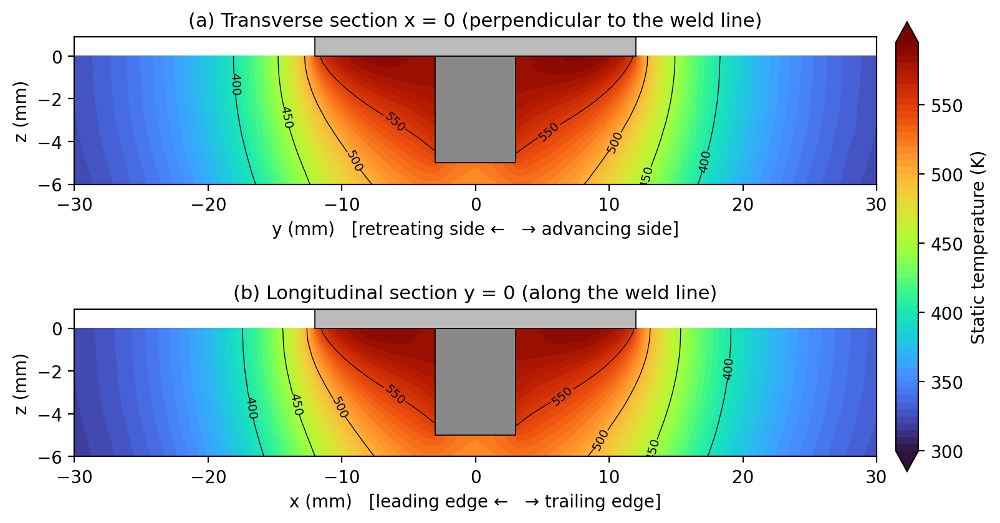
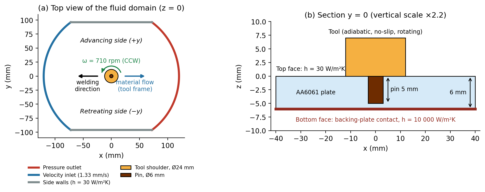
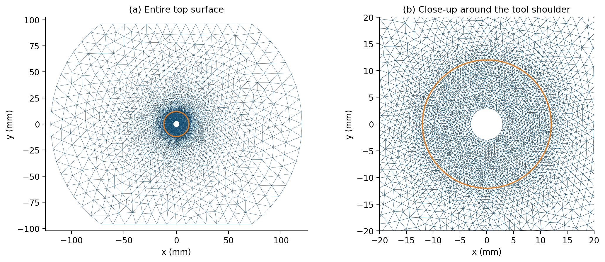
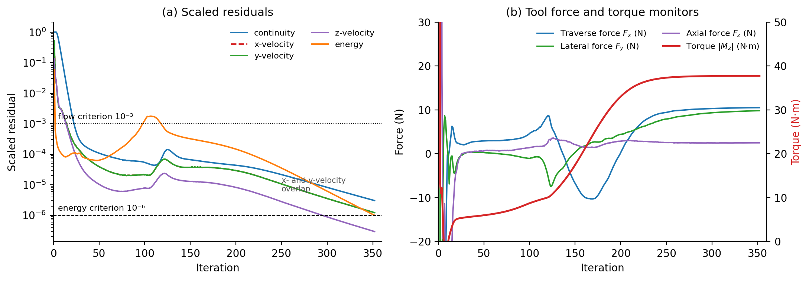
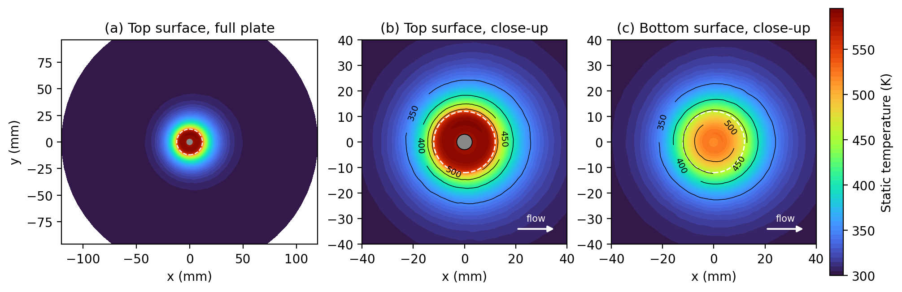
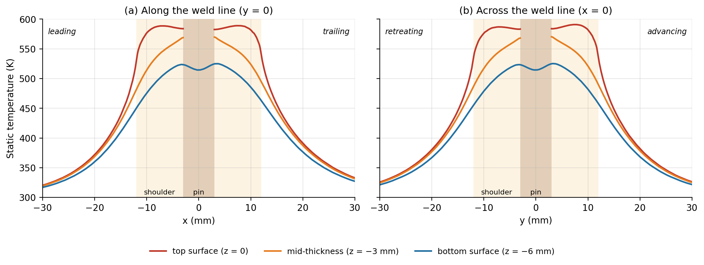
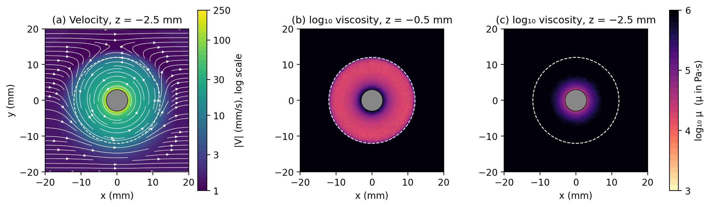
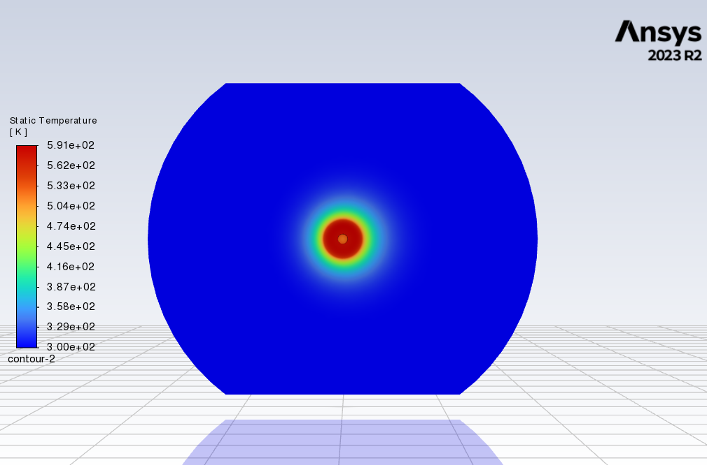
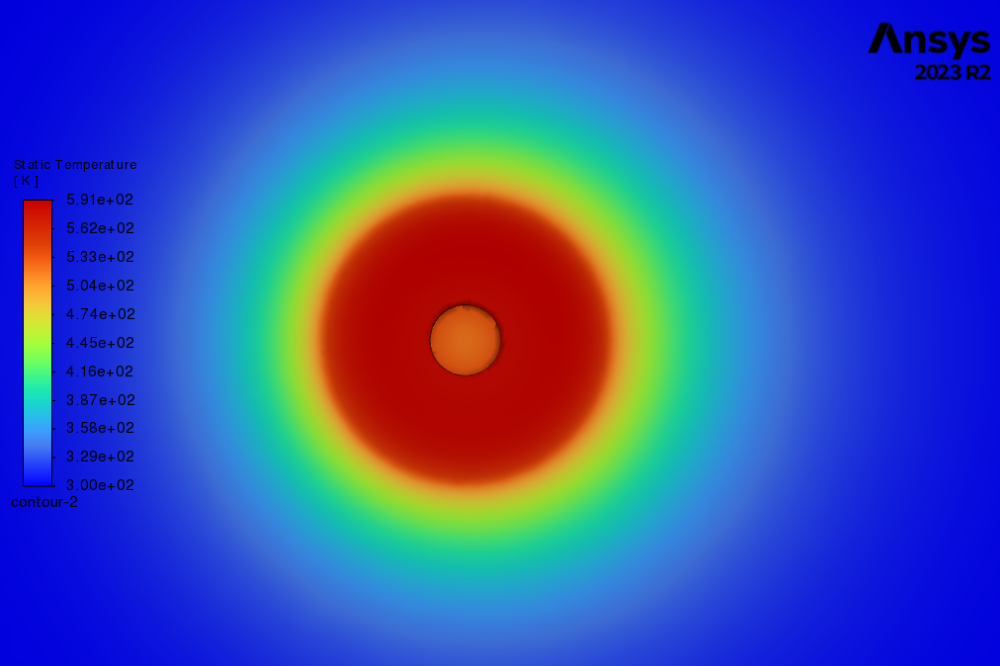
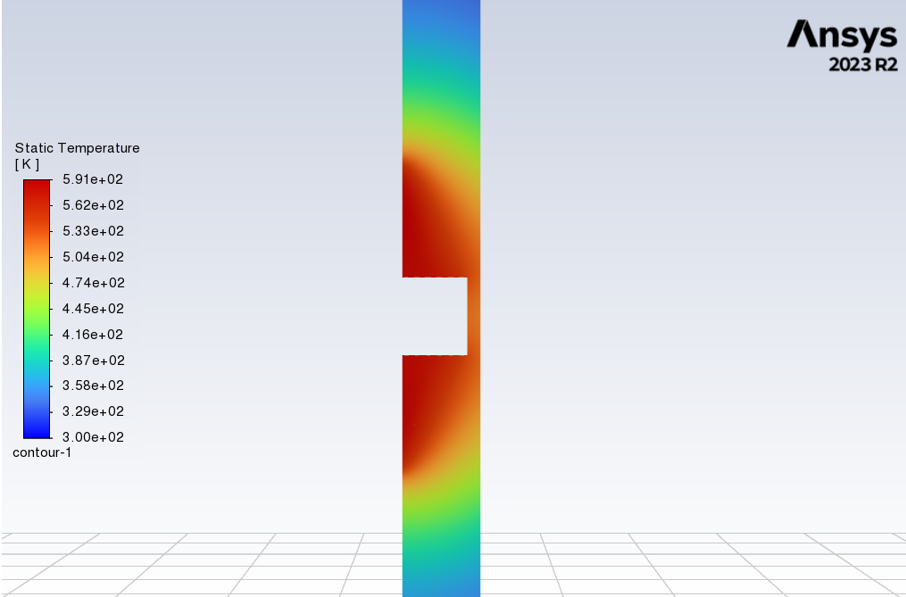

# Friction Stir Welding of AA6061 — 3D CFD Simulation in ANSYS Fluent


A steady, three-dimensional thermo-fluid model of **friction stir welding (FSW)** of a 6 mm **AA6061** aluminium plate. The plasticised metal is modelled as a highly viscous, non-Newtonian fluid flowing past a rotating tool (Eulerian / tool-fixed frame), and heat is generated entirely by viscous dissipation. The model predicts the temperature field, the material flow around the pin and shoulder, and the torque and forces on the tool.

<p align="center">
  
</p>

---

## Key results

| Quantity | Value |
|---|---|
| Peak temperature | **591 K (318 °C)** at the shoulder interface, advancing side (≈ 0.69 T<sub>solidus</sub>) |
| Peak bottom-surface temperature | 525 K |
| Tool torque | **37.73 N·m** |
| Tool power / heat input | 2.81 kW / ≈ 2.1 kJ/mm |
| Energy balance | heat leaving the domain matches tool power within **2 %** |
| Convergence | 352 iterations (energy residual 10⁻⁶) |

Temperature is only mildly asymmetric: the trailing side is ~19 K hotter than the leading side, and the advancing and retreating sides differ by ~2 K. This is because conduction dominates at this low welding speed (Péclet number ≈ 0.22).

---

## Problem setup

### Process parameters

| Parameter | Value |
|---|---|
| Plate | AA6061, 6 mm thick |
| Tool | flat shoulder Ø24 mm, cylindrical pin Ø6 mm × 5 mm (unthreaded, no tilt) |
| Rotational speed | 710 rpm (74.351 rad/s), counter-clockwise about +z |
| Welding speed | 79.8 mm/min (1.33 mm/s) |

### Geometry and computational domain

The workpiece is a 120 mm radius disc cut flat at y = ±96 mm. Material enters through the upstream arc at the welding speed and leaves through the downstream arc. With CCW rotation, **+y is the advancing side**.

<p align="center"></p>

### Governing equations

The workpiece is an incompressible, laminar, non-Newtonian fluid. Fluent solves mass, momentum and energy conservation, with viscous heating as the only heat source:

$$\nabla\cdot\mathbf{u}=0,\qquad \rho(\mathbf{u}\cdot\nabla)\mathbf{u}=-\nabla p+\nabla\cdot\left[\mu\left(\nabla\mathbf{u}+\nabla\mathbf{u}^{T}\right)\right],\qquad \rho c_p(\mathbf{u}\cdot\nabla)T=\nabla\cdot(k\nabla T)+\mu\dot{\gamma}^2$$

### Material model (AA6061)

The viscosity follows a power law with Arrhenius-type temperature dependence (Fluent *non-newtonian-power-law*, shear-rate and temperature dependent):

$$\mu = K\,\dot{\gamma}^{\,n-1}\exp\Big[\alpha\Big(\frac{1}{T}-\frac{1}{T_\alpha}\Big)\Big],\qquad 10^{3}\le\mu\le10^{6}\ \mathrm{Pa\cdot s}$$

| Property | Value |
|---|---|
| Density | 2700 kg/m³ |
| Specific heat c<sub>p</sub>(T) | 929 − 0.627T + 1.48×10⁻³T² − 4.33×10⁻⁸T³ J/(kg·K) |
| Thermal conductivity k(T) | 25.2 + 0.398T + 7.36×10⁻⁶T² − 2.52×10⁻⁷T³ W/(m·K) |
| Consistency index K / power-law index n | 6.88×10⁷ / 0.0421 |
| α (activation energy/R) / reference temperature T<sub>α</sub> | 1380 K / 298 K |

With n = 0.0421 the material is strongly shear-thinning, which approximates a rigid–visco-plastic solid. Material far from the tool reaches the 10⁶ Pa·s cap and moves as a rigid body.

### Boundary conditions

| Zone (name in model) | Condition |
|---|---|
| `velocityinlet` | 1.33 mm/s in +x, T = 300 K |
| `pressureoutlet` | 0 Pa gauge |
| `fswtool` | no-slip rotating wall, 74.351 rad/s, adiabatic (full sticking) |
| `topface` | moving wall 1.33 mm/s, h = 30 W/(m²·K) |
| `buttomface` | moving wall 1.33 mm/s, h = 10 000 W/(m²·K) (backing plate) |
| `wall-solid` (side faces) | moving wall 1.33 mm/s, h = 30 W/(m²·K) |

### Mesh and solver

The mesh has **133 592 tetrahedral cells** (26 167 nodes), graded from ≈0.5 mm under the shoulder to ≈7.4 mm at the outer boundary. The case uses the pressure-based steady solver with coupled pressure–velocity coupling and the pseudo-transient method, second-order spatial discretisation, and 4 parallel cores.

<p align="center"></p>

---

## Results

### Convergence

The torque, the key output, settles to within 0.08 % over the last 50 iterations. The lateral force was still drifting (~4.6 %), so treat it as approximate.

<p align="center"></p>

### Temperature field

<p align="center"></p>

<p align="center"></p>

The isotherms are basin-shaped: wide under the shoulder and narrowing towards the bottom, the characteristic "wine-cup" shape of FSW. The bottom face is about 65 K cooler than the peak.

### Material flow and viscosity

Material near the pin co-rotates with the tool (up to ≈ 223 mm/s at the pin surface), and incoming material is carried around the pin mainly on the retreating side. Low viscosity, i.e. actively deforming material, is found across the region under the shoulder and in a thin (~1.3 mm) shear layer around the pin.

<p align="center"></p>

### Tool loads and energy balance

| Load | Value | Note |
|---|---|---|
| Torque M<sub>z</sub> | −37.73 N·m | opposes rotation; most reliable load output |
| Traverse force F<sub>x</sub> | 10.51 N | underestimated (see limitations) |
| Lateral force F<sub>y</sub> | 9.82 N | not fully converged |
| Axial force F<sub>z</sub> | 2.50 N | not physically meaningful in this formulation |

The tool power M·ω = 2.81 kW is balanced by ≈ 2.86 kW of heat leaving the domain, 99.7 % of it through the bottom (backing-plate) face.

### Fluent screenshots

| Top view (Fluent) | Close-up around the tool (Fluent) |
|---|---|
|  |  |
| **Transverse section (Fluent)** | **Force & torque report (Fluent console)** |
|  |  |

---

## Limitations

- **Forces are not captured.** Local shoulder pressures reach −15 to +22 MPa but nearly cancel, so the axial force is ~2.5 N instead of the kN-level forging load of a real weld. The forging load, the free surface and elastic effects are not part of an incompressible flow model.
- **Idealised interface and heat sources.** Full sticking is assumed at the tool with no partial sliding. All heat comes from viscous dissipation, and the tool is adiabatic.
- **No mesh-independence study and no experimental validation.** The material constants were not calibrated.
- **Simplified tool and process.** The pin is unthreaded and the shoulder untilted, and only the steady traverse stage is modelled (no plunge or dwell).

## Future work

- Mesh-independence study, and validation against thermocouple and torque measurements
- Partial-sliding (slip) interface model; conduction through the tool
- Parametric sweeps of rotational and welding speed; threaded or tapered pins; tool tilt
- Particle tracking to visualise material transport and estimate the stir-zone boundary

---

## Repository structure

```
fsw-cfd-aa6061/
├── FSW.wbpj                        # ANSYS Workbench project - open this in Workbench 2023 R2
├── FSW_files/                      # Workbench data: geometry, mesh, Fluent case/data, monitors
│   └── dp0/FFF/Fluent/*-rfile.out  # force & torque histories (plain text)
├── Case_data_manual.cas.h5         # Fluent case file (standalone copy)
├── Case_data_manual.dat.h5         # Fluent data file - converged solution (iteration 352)
├── images/                         # figures used in this README and the report
├── postprocessing/
│   ├── fsw_postprocess.py          # regenerates all figures from the HDF5 files
│   └── requirements.txt
├── report/
│   ├── FSW_CFD_Report.pdf          # 6-page project report
│   └── FSW_CFD_Report.docx
├── .gitignore
└── README.md
```

All files are under GitHub's 100 MB limit (largest ≈ 9 MB), so Git LFS is not required.

## How to reproduce

**In ANSYS (Workbench/Fluent 2023 R2 or newer):**
1. Open `FSW.wbpj` in ANSYS Workbench. The Fluid Flow (Fluent) system contains the geometry, mesh, setup and solution.
2. Alternatively, open Fluent directly and use *File → Read → Case & Data* on `Case_data_manual.cas.h5` to inspect the converged result.

**Post-processing without ANSYS (Python):**

The script reads the Fluent HDF5 files and monitor outputs directly and regenerates every figure in `images/`, plus a summary of key numbers.

```bash
pip install -r postprocessing/requirements.txt
python postprocessing/fsw_postprocess.py
```

## References

1. R.S. Mishra, Z.Y. Ma, *Friction stir welding and processing*, Materials Science and Engineering R 50 (2005) 1–78.
2. P.A. Colegrove, H.R. Shercliff, *3-Dimensional CFD modelling of flow round a threaded friction stir welding tool profile*, J. Materials Processing Technology 169 (2005) 320–327.
3. R. Nandan, G.G. Roy, T. DebRoy, *Numerical simulation of three-dimensional heat transfer and plastic flow during friction stir welding*, Metall. Mater. Trans. A 37 (2006) 1247–1259.
4. T.U. Seidel, A.P. Reynolds, *Two-dimensional friction stir welding process model based on fluid mechanics*, Sci. Technol. Weld. Join. 8 (2003) 175–183.
5. ANSYS Inc., *Ansys Fluent Theory Guide*, Release 2023 R2.

## Author

**Sambit Kumar Sahoo** — Dual Degree (B.Tech Mechanical + M.Tech Manufacturing Science & Engineering), IIT Kharagpur
